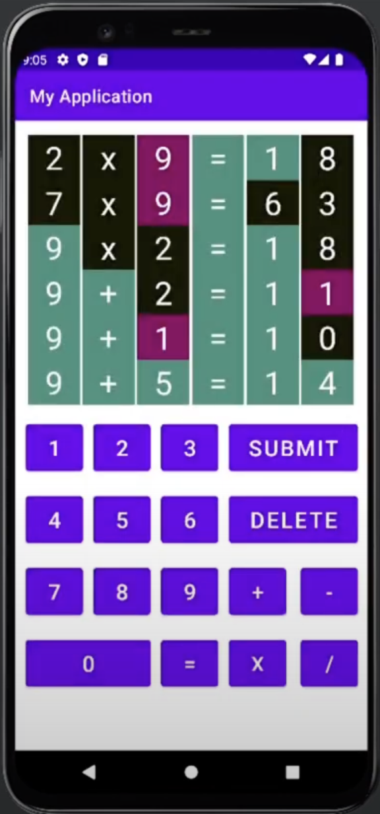
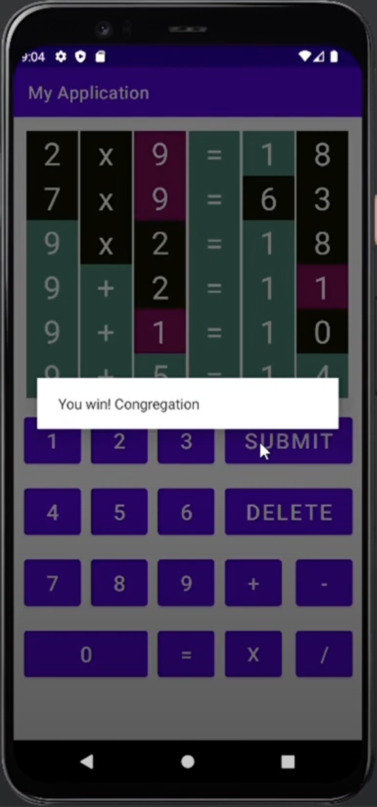

# Kotlin Android Nerdle Game


A fully functional logic puzzle game for Android, developed natively using Kotlin. This project is a mobile implementation inspired by the popular number-guessing game, Nerdle. The app features a dynamic puzzle system: upon each launch, a complete "puzzle bank" of all valid equations is generated in real-time. This run-time generation strategy ensures a unique puzzle sequence for every session while keeping the application's installation size minimal.

---

## Key Features & Highlights

* **Valid Equation Generation Algorithm:**
    The app features a custom-built solver that randomly generates a valid, 6-character mathematical equation for each new game. The algorithm ensures every generated puzzle is mathematically correct and adheres to all game rules (e.g., contains one operator, no negative numbers, no leading zeros).

* **Dynamic UI & State Management:**
    The game board provides real-time, color-coded feedback, similar to Wordle, to guide the player. The background of each character `TextView` is dynamically updated after each guess to indicate if a character is correct (green), misplaced (purple-ish), or incorrect (black). The app robustly manages the game state, including guess attempts remaining and input validation.

* **Clean User Experience (UX):**
    User interaction is handled through clear and non-intrusive `AlertDialog` components. These are used to provide helpful feedback for invalid inputs (e.g., "This is not an valid equation"), congratulate the player upon winning, and display the correct answer if the player runs out of attempts.

---

## Showcase (Screenshots)

<div align="center">

| In-Game Guessing | Winning Dialog |
| :---: | :---: |
|  |  |

</div>

---

### Core Algorithm: Equation Generation

To ensure a unique and valid puzzle for every game, the app employs a **run-time generation and randomization** strategy for its puzzle bank.

The logic is as follows:

1.  **Generate on Startup:** Each time the application is launched, an algorithm runs to **exhaustively generate all possible valid 6-character equations** that adhere to the game's rules (non-negative integers, single `+ - * /` operator, no leading zeros, etc.).

2.  **Populate a "Puzzle Bank":** These valid equations are temporarily loaded into an in-memory list. This collection serves as the "puzzle bank" for the current app session.

3.  **Shuffle and Serve:** The app then **shuffles** this dynamically generated list and selects an element from it to be the puzzle for the first game. Subsequent puzzles are drawn from this shuffled list for the duration of the app session.

This run-time generation approach ensures a different puzzle sequence on every app launch and keeps the application's installation size minimal.

---

## How to Build and Run

1.  **Clone the repository:**
    ```sh
    git clone https://github.com/kurenaishiu/Kotlin-Android-Nerdle-Game.git
    ```
2.  **Open in Android Studio:**
    * Launch Android Studio.
    * Select `File -> Open` and navigate to the cloned project directory.
3.  **Sync and Run:**
    * Allow Gradle to sync and download the necessary dependencies.
    * Run the app on an Android emulator or a physical device.

---

## Tech Stack

* **Language:** Kotlin
* **IDE:** Android Studio
* **Platform:** Android SDK
* **UI Components:** `LinearLayout`, `TextView`, `Button`, `AlertDialog`

---